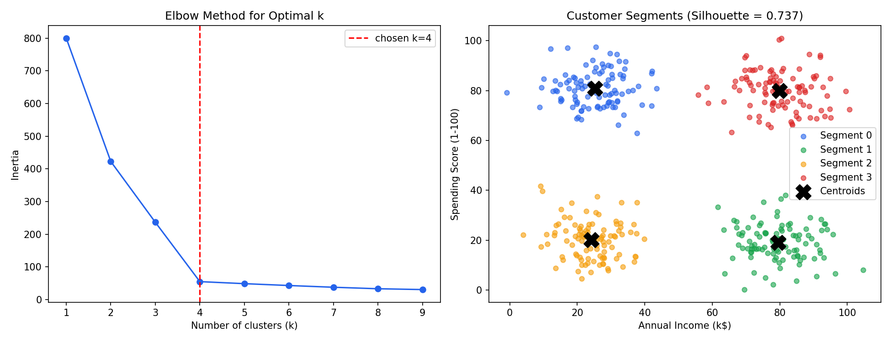

# K-Means Clustering — Customer Segmentation

Groups customers into segments based on **annual income** and **spending score**, with no labels given — the algorithm discovers the groups on its own (unsupervised learning).

**Algorithm:** K-Means Clustering
**Dataset:** Synthetic customer data (400 samples, generated in-script around 4 natural income/spending profiles)

## Results

| Metric | Value |
|---|---|
| Chosen k | 4 |
| Silhouette Score | 0.7367 |

| Segment | Income | Spending Score | Size |
|---|---|---|---|
| 0 | ~25k | ~81 | 99 |
| 1 | ~80k | ~19 | 100 |
| 2 | ~24k | ~20 | 100 |
| 3 | ~80k | ~80 | 101 |



*Left: elbow method used to pick k=4. Right: the 4 discovered customer segments with centroids marked.*

## How it works

1. Generate synthetic income/spending data around 4 hidden customer profiles.
2. Standardize features.
3. Run the elbow method (`k = 1..9`) to choose the number of clusters.
4. Fit final `KMeans(k=4)`.
5. Evaluate cluster quality with the silhouette score and visualize segments.

## Run it

```bash
pip install -r requirements.txt
python kmeans_clustering.py
```

## Project structure

```
04-kmeans-customer-segmentation/
├── kmeans_clustering.py
├── requirements.txt
├── README.md
└── screenshots/
    └── results.png
```
